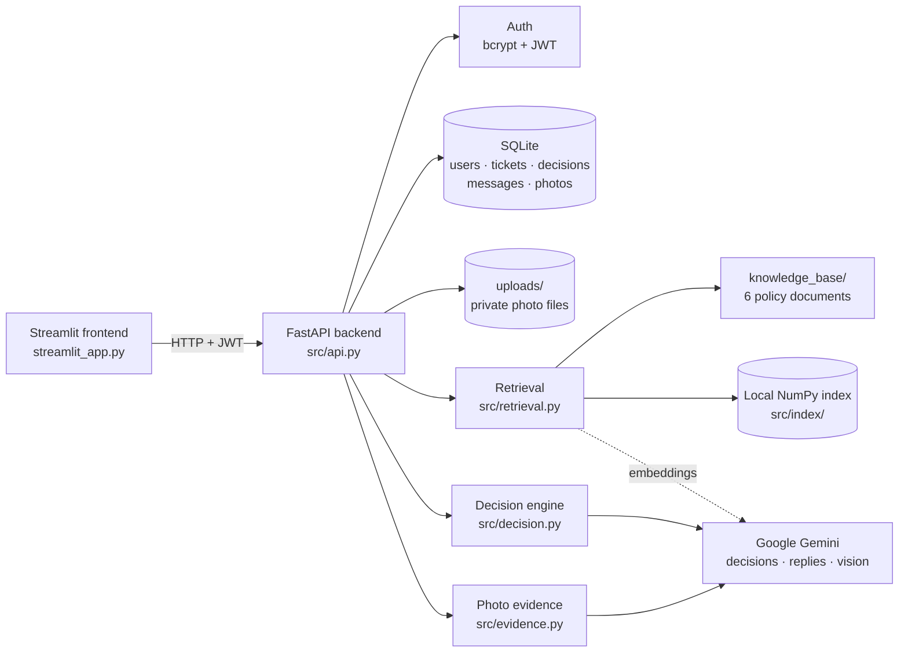

<p align="center">
  
</p>

<p align="center">
  
  
  
  
  
  
</p>

**PolicyPilot AI** reads a customer-support ticket, finds the company policy rules that apply, and returns a **structured, policy-backed decision**: one action from a fixed list, a reason that names the rule, and the policy files it relied on. The customer can then continue **the same ticket**. They can ask questions and get AI answers, upload photos when evidence is requested, and state whether they want a refund or a replacement. The ticket is reassessed after each turn.

Built as an AI & backend engineering internship project with FastAPI, Streamlit, SQLite, JWT authentication, local retrieval (RAG) and Google Gemini.

---

## Contents

1. [Overview](#overview)
2. [Key features](#key-features)
3. [Screenshots](#screenshots)
4. [How it works](#how-it-works)
5. [Technology stack](#technology-stack)
6. [Project structure](#project-structure)
7. [Installation and setup](#installation-and-setup)
8. [Usage guide](#usage-guide)
9. [API reference](#api-reference)
10. [Policy and decision logic](#policy-and-decision-logic)
11. [Testing and evaluation](#testing-and-evaluation)
12. [Security and limitations](#security-and-limitations)
13. [Future improvements](#future-improvements)
14. [License and acknowledgments](#license-and-acknowledgments)

---

## Overview

**The problem.** Support teams answer the same kinds of tickets over and over: damaged parcels, wrong items, late deliveries, cancellations, returns. The right answer depends on policy details that are easy to misapply: a ₹2,000 photo threshold, a 7-day reporting window, a food-return exclusion. Answers get inconsistent, and it's hard to see *why* a decision was made.

**What PolicyPilot AI does.** It turns a complaint plus the known order facts into a decision that is grounded in the written policy:

- It **retrieves** the relevant rules from the company's policy documents.
- It asks **Gemini** to apply them, and constrains the answer to a closed set of 15 actions.
- It **validates** the output before storing it, and records **which policy files** support it.
- It keeps the **whole ticket history**: every decision, message and photo.

**Who it's for.** Support agents and customers handling e-commerce tickets, and anyone evaluating how to make LLM decisions auditable.

**How it differs from a chatbot.** A chatbot produces free text. PolicyPilot AI produces a **decision** that the code then checks:

| A general chatbot | PolicyPilot AI |
|---|---|
| Free-form answer | One action from a **closed list of 15**, schema-validated |
| May use general knowledge | Answers from the **retrieved policy text only**, with citations |
| Nothing stops a wrong approval | **Code-level guardrails**: no refund, replacement or return after an evidence request without usable photo evidence |
| Can invent timelines ("5–7 business days") | Replies with invented periods, dates or "refund processed" claims are **caught and rewritten** |
| Conversation is ephemeral | Tickets, decisions, messages and photos are **persisted** per user |

---

## Key features

Every feature below is implemented and covered by tests.

| Feature | Details |
|---|---|
| **Accounts** | Registration and login; passwords hashed with **bcrypt** |
| **JWT authentication** | `Authorization: Bearer <token>` on every protected route |
| **Ownership protection** | A user can only read or change their own tickets and photos; other users' IDs return `404` |
| **Policy-grounded decisions (RAG)** | Policy rules are retrieved by embedding similarity and passed to Gemini |
| **Structured output** | `action`, `confidence`, `reason`, `sources`, validated with Pydantic before saving |
| **Missing information** | Returns `NEEDS_MORE_INFORMATION` and asks a specific question instead of guessing |
| **Photo evidence** | JPEG/PNG/WEBP upload when photos or defect evidence are requested; stored privately |
| **Photo analysis** | Gemini vision describes only what is visible: *clear*, *relevant*, *shows the issue* |
| **Same-ticket follow-ups** | Customers ask questions or add facts; the **AI replies** and the ticket is reassessed |
| **Refund or replacement preference** | Asked for when the decision offers a choice; recorded as a preference, never as a completed action |
| **Decision history** | Earlier decisions are kept; a new one is added only when the action changes |
| **Decision basis** | A rule-based label (*awaiting customer / clear policy match / review recommended*) instead of a misleading confidence % |
| **Evaluation runner** | Scores the pipeline against the supplied labelled cases |

---

## Screenshots

> No screenshots are committed yet.
>
> To add them, run the app with a demo account, capture the screens below, save them in `assets/screenshots/`, and reference them here. For example: ``.
>
> Suggested: **Login**, **New Decision with a result**, **photo evidence with the analysis**, and **the ticket conversation** with an AI reply.

---

## How it works

1. **The customer submits a ticket**: a message, plus whatever order facts are known (value, days since delivery or dispatch, product type, opened or unopened, order status). Unknown fields stay empty and are shown to the model as *not provided*.
2. **Retrieval** embeds the ticket, ranks the 29 policy rules by cosine similarity, and then includes **every** rule from the matching policy files. A threshold and its exception live in different rules, so they must travel together.
3. **Gemini decides** with a strict response schema: one of 15 actions, a reason naming the rule, a self-rating, and the policy files used.
4. **The code validates** the reply (schema, allowed action, confidence range), drops any citation that wasn't in the retrieved text, and stores the decision with its **decision basis**.
5. **If evidence is needed** (`REQUEST_PHOTOS` / `REQUEST_DEFECT_EVIDENCE`), the ticket shows a photo upload.
6. **Photos are analysed** by a separate Gemini vision call, which only describes what is visible. The decision model then reasons over that description; it never sees the image itself.
7. **The customer continues the same ticket.** Each follow-up gets an AI reply, and the ticket is reassessed with the full conversation, photo findings and decision history.
8. **Everything is persisted**: tickets, decisions, messages (customer and AI), photo metadata and preferences. Photo files are kept in a private folder.



### What the AI does vs. what the code enforces

| Gemini (AI) | Code (deterministic) |
|---|---|
| Reads the retrieved policy rules and picks an action | Only the 15 allowed actions are accepted; malformed output is retried once, then `503`, never saved |
| Writes the reason and the customer reply | Citations not in the retrieved text are removed |
| Describes what is visible in photos | After an evidence request, **no refund, replacement or return** without a photo that is clear, relevant **and** shows the issue |
| Suggests a customer preference | A preference counts only if plainly stated (not a question) and the decision offers a choice |
| Rates its own confidence | The UI shows a **rule-based decision basis**; the number is labelled *uncalibrated* |
| | Replies with invented time periods, dates or completion claims are rejected and rewritten |
| | Ownership is enforced in every database query |

---

## Technology stack

| Layer | Technology |
|---|---|
| Language | Python 3.11+ (developed and tested on 3.14) |
| Backend API | FastAPI 0.141 · Uvicorn 0.53 · Pydantic 2.13 · pydantic-settings |
| Database | SQLite · SQLAlchemy 2.0 |
| Authentication | PyJWT 2.14 (HS256) · bcrypt 5.0 |
| AI | Google Gemini via `google-genai` 2.24: `gemini-3.5-flash` for decisions, replies and vision; `gemini-embedding-001` for embeddings |
| Retrieval | NumPy cosine similarity over a local `.npz` index (no hosted vector database) |
| Frontend | Streamlit 1.64 · Requests |
| File uploads | python-multipart |
| Testing | pytest 9.1 · FastAPI `TestClient` (httpx) |

All versions are pinned in [`requirements.txt`](requirements.txt).

---

## Project structure

```
.
├── src/
│   ├── api.py            FastAPI app: auth, tickets, follow-ups, photo download
│   ├── auth.py           bcrypt hashing, JWT issue/verify, current-user dependency
│   ├── config.py         settings loaded from .env (defaults live here)
│   ├── database.py       SQLAlchemy engine, session, table creation
│   ├── models.py         users, tickets, decisions, ticket_messages, ticket_photos
│   ├── schemas.py        Pydantic request/response models — the API trust boundary
│   ├── actions.py        the 15 allowed actions and what each one is for
│   ├── retrieval.py      load → chunk → embed → cache → cosine search
│   ├── decision.py       prompts, Gemini calls, validation, guardrails, replies, decision basis
│   └── evidence.py       photo validation, private storage, vision analysis
├── tests/                automated test suite (Gemini fully stubbed, runs offline)
├── knowledge_base/       the 6 policy documents the decisions are based on
├── data/
│   ├── tickets.csv               214 labelled historical tickets (evaluation only)
│   ├── sample_test_cases.json    the 5 supplied evaluation cases
│   └── DATA_NOTES.md             notes supplied with the dataset
├── assets/               logo and banner (SVG)
├── streamlit_app.py      the frontend
├── evaluate.py           accuracy runner for the labelled cases
├── requirements.txt      pinned dependencies
├── .env.example          configuration template (placeholders only)
├── DEVELOPMENT.md        how the project was built, including AI coding-tool usage
└── README.md
```

Created locally at runtime and **git-ignored**: `.env`, `policypilot.db`, `uploads/` (customer photos) and `src/index/` (embedding cache).

---

## Installation and setup

### Prerequisites

- **Python 3.11 or newer**
- **A Google Gemini API key**, free from [Google AI Studio](https://aistudio.google.com/u/0/api-keys)
- Git

### 1. Clone and enter the project

```bash
git clone <repository-url>
cd <repository-folder>
```

### 2. Create a virtual environment and install dependencies

```bash
python -m venv .venv            # or: uv venv

# activate it
.venv\Scripts\activate          # Windows
source .venv/bin/activate       # macOS / Linux

python -m pip install -r requirements.txt   # or: uv pip install -r requirements.txt
```

### 3. Configure environment variables

```bash
cp .env.example .env            # Windows: copy .env.example .env
```

Edit `.env` and set the two required values:

| Variable | Required | Notes |
|---|---|---|
| `GEMINI_API_KEY` | **yes** | Your own key. Never commit it. |
| `JWT_SECRET` | **yes** | At least 32 characters; the app refuses to start with a shorter one |

Generate a secret:

```bash
python -c "import secrets; print(secrets.token_urlsafe(32))"
```

Optional overrides (defaults in [`src/config.py`](src/config.py)): `JWT_EXPIRE_MINUTES` (60), `DATABASE_URL` (`policypilot.db` in the project folder), `GEMINI_MODEL` (`gemini-3.5-flash`), `EMBEDDING_MODEL` (`gemini-embedding-001`), `API_BASE_URL` (`http://127.0.0.1:8000`).

### 4. Run it: two terminals, both with the virtual environment active

```bash
# Terminal 1 — backend
python -m uvicorn src.api:app --reload
```

```bash
# Terminal 2 — frontend
python -m streamlit run streamlit_app.py
```

| | URL |
|---|---|
| App | <http://localhost:8501> |
| API | <http://127.0.0.1:8000> |
| Interactive API docs (Swagger UI) | <http://127.0.0.1:8000/docs> |

**No manual database setup is needed.** Tables are created when the backend starts. The first ticket builds the embedding index (one embedding call) and caches it in `src/index/`; it rebuilds automatically if a policy file changes. On its very first launch, Streamlit may ask for an email address in the terminal. Just press **Enter** to skip.

> **Upgrading an older copy?** SQLite tables are created but never altered automatically. If you ran an earlier version, delete `policypilot.db` before starting.

---

## Usage guide

1. **Register and log in** on the start screen.
2. **Create a ticket** in **New Decision**. Describe the problem and fill in the facts you know. Leave unknown numbers **empty**, which means *unknown*.
3. **Read the decision**: the action, the **decision basis** badge, the reason, and the **policy sources**.
4. **Upload photos when asked.** If the decision is *Request Photos* (or *Request Defect Evidence*), a **📷 Photos needed** box appears. Upload up to 5 JPEG/PNG/WEBP files (≤ 5 MB each) and click **Submit Photos**. Each photo shows what the AI could see, and the ticket is reassessed.
5. **Continue the conversation** in the box under the decision. Ask a question ("When will I get my refund?"), answer the AI's question, or add facts. The AI replies on the same ticket.
6. **State a preference** when the decision offers a refund *or* a replacement ("I'd prefer a replacement"). It's shown as *recorded, not yet processed*.
7. **Review history** in the **History** tab. Every ticket keeps its full conversation, photos and decision changes.

**Worth knowing:** the app records eligibility and preferences. It does **not** issue refunds or ship replacements. The policies say nothing about processing times, so the AI will tell you it can't confirm one.

---

## API reference

All ticket routes require `Authorization: Bearer <JWT>` and only ever return the caller's own data. Full interactive documentation is at `/docs`.

| Method | Endpoint | Auth | Purpose |
|---|---|---|---|
| `POST` | `/register` | — | Create an account (`email`, `password` ≥ 8 chars) → `201` |
| `POST` | `/login` | — | Returns `{access_token, token_type: "bearer"}` |
| `GET` | `/me` | ✅ | The authenticated user (`id`, `email`, `created_at`) |
| `POST` | `/tickets` | ✅ | Submit a ticket; runs retrieval + Gemini; stores the decision → `201` |
| `GET` | `/tickets` | ✅ | Your tickets, newest first, with the current action |
| `GET` | `/tickets/{id}` | ✅ | One ticket: facts, current decision, decision history, messages, photos, preference |
| `POST` | `/tickets/{id}/follow-ups` | ✅ | Multipart: `message` and/or `photos` (≤ 5). Stores the AI reply, reassesses → `201` |
| `GET` | `/tickets/{id}/photos/{photo_id}` | ✅ | Download one of your own evidence photos |
| `GET` | `/health` | — | Liveness check |

<details>
<summary><b>Example: create a ticket</b></summary>

```bash
curl -X POST http://127.0.0.1:8000/tickets \
  -H "Authorization: Bearer $TOKEN" -H "Content-Type: application/json" \
  -d '{"message": "My glass vase worth Rs 1,500 arrived cracked yesterday.",
       "order_value_inr": 1500, "days_since_delivery": 1,
       "product_type": "non_food", "opened_status": "opened", "order_status": "delivered"}'
```

Request fields: `message` (required), and optionally `order_value_inr`, `days_since_delivery`, `days_since_dispatch`, `product_type` (`food` · `non_food` · `mixed` · `unknown`), `opened_status` (`opened` · `unopened` · `unknown`), `order_status` (`processing` · `dispatched` · `delivered` · `unknown`).

Response (abridged):

```json
{
  "id": 1,
  "message": "My glass vase worth Rs 1,500 arrived cracked yesterday.",
  "preferred_resolution": null,
  "decision": {
    "action": "APPROVE_REFUND_OR_REPLACEMENT",
    "confidence": 1.0,
    "reason": "The damaged glass vase was reported within 1 day, and since the order value of Rs. 1,500 is Rs. 2,000 or less, photographic evidence is not required.",
    "sources": ["damaged_goods.md"],
    "basis": "clear",
    "basis_reasons": [],
    "created_at": "..."
  },
  "decisions": ["...every decision, oldest first..."],
  "messages": [],
  "photos": []
}
```
</details>

<details>
<summary><b>Example: follow up with a question, or with photos</b></summary>

```bash
# a question
curl -X POST http://127.0.0.1:8000/tickets/1/follow-ups \
  -H "Authorization: Bearer $TOKEN" -F "message=When will I get my refund?"

# photos (and an optional note)
curl -X POST http://127.0.0.1:8000/tickets/2/follow-ups \
  -H "Authorization: Bearer $TOKEN" \
  -F "message=Here is the broken item" -F "photos=@broken.jpg" -F "photos=@box.jpg"
```

The response is the updated ticket. `messages` now ends with the customer's message and the AI reply (`role: "assistant"`), and `photos` lists metadata and analysis (never the server file path).
</details>

### Status codes

| Code | Meaning |
|---|---|
| `401` | Missing, malformed, expired or wrongly-signed token; wrong email or password |
| `404` | Ticket or photo not found **or** belongs to another user (deliberately indistinguishable) |
| `409` | Email already registered |
| `413` | Photo larger than 5 MB |
| `415` | File is not a JPEG, PNG or WEBP image (detected from its bytes, not its name) |
| `422` | Invalid payload; empty follow-up; more than 5 photos |
| `503` | Gemini unavailable, or its output failed validation twice; **nothing is saved** |

---

## Policy and decision logic

### Knowledge base

Six policy documents, split into **one chunk per numbered rule** (29 rules):

| Document | Rules | Covers |
|---|---|---|
| `cancellations.md` | 4 | Cancelling before / after dispatch |
| `damaged_goods.md` | 5 | 7-day reporting window; photos required above ₹2,000 |
| `defective_products.md` | 5 | 14-day window; evidence required above ₹3,000 |
| `returns.md` | 5 | Change-of-mind returns; opened items; food products |
| `shipping.md` | 5 | Wait, investigate, or replace/refund by days since dispatch |
| `wrong_item.md` | 5 | 7-day window; replacement, or refund if unavailable |

### The 15 actions

The action vocabulary comes from `data/tickets.csv`, where each action belongs to exactly one situation. Each action's situation is described to the model; thresholds and time windows always come from the policy text.

| Situation | Actions |
|---|---|
| Cancellation | `CANCEL_AND_REFUND` · `CANNOT_CANCEL_AFTER_DISPATCH` |
| Damaged goods | `APPROVE_REFUND_OR_REPLACEMENT` · `REQUEST_PHOTOS` |
| Defective product | `APPROVE_REPLACEMENT` · `REQUEST_DEFECT_EVIDENCE` |
| Change-of-mind return | `APPROVE_RETURN` · `REJECT_OPENED_ITEM` · `REJECT_FOOD_RETURN` |
| Undelivered order | `WAIT_AND_TRACK` · `OPEN_SHIPPING_INVESTIGATION` · `OFFER_REPLACEMENT_OR_REFUND` |
| Wrong item | `REPLACE_CORRECT_ITEM` |
| Any claim | `REJECT_OUTSIDE_WINDOW` · `NEEDS_MORE_INFORMATION` |

### How specific situations are handled

- **Missing information:** unknown facts are shown to the model as *not provided*. If the policy can't be applied without them, the decision is `NEEDS_MORE_INFORMATION` and the reply asks one specific question. If the customer's words contradict a field, the model is told to ask rather than pick one.
- **Evidence requirements:** above the policy thresholds, photos or defect evidence are requested first. Photos never override other rules. Genuine damage photos reported after the 7-day window still produce `REJECT_OUTSIDE_WINDOW`.
- **Citations:** `sources` may only contain policy files that were actually retrieved.
- **Decision updates:** each follow-up reassesses the ticket. A new decision is stored only when the action changes, so the history shows real changes rather than repeats.
- **Decision basis:** *Awaiting customer* when information or evidence is requested. *Review recommended* when the model cited no matching policy, rated itself below 0.8, or the decision changed because of the customer's own statements rather than ticket data or photos. Otherwise *Clear policy match*. The model's `confidence` is **not calibrated** (it is almost always ~1.0), so it is not shown as a percentage.
- **Historical tickets** (`data/tickets.csv`) are used **only** to score the evaluation. Decisions are never made by looking up a similar past ticket.

---

## Testing and evaluation

### Automated tests (no API key needed)

```bash
python -m pytest tests/ -q
```

The suite runs fully offline: every Gemini call is stubbed, uploads go to a temporary folder, and a fixture fails any test that tries to reach the real API.

| File | Covers |
|---|---|
| `test_auth.py` | Hashing and salting, the 72-byte bcrypt limit, duplicate emails, login failures, forged, expired and deleted-user tokens |
| `test_tickets.py` | Creation, validation, history, detail, **ownership** (Alice can't read Bob's ticket), rollback on AI failure |
| `test_retrieval.py` | All 6 policies load into 29 rule chunks, thresholds survive chunking, ranking, index caching |
| `test_decision.py` | Schema rejection (invented actions, bad confidence, extra keys), whole-document context, citation grounding, retry-then-fail |
| `test_followups.py` | Same-ticket follow-ups and AI replies, no duplicate decisions, photo validation and private storage, cross-user access, the evidence guardrail, invented-timeline and "refund processed" detection, preference rules, decision basis |

The key safety rules were **mutation-checked**: each was deliberately disabled to confirm the tests fail without it.

### Evaluation against the labelled cases (needs an API key)

```bash
python evaluate.py                    # the 5 supplied cases in data/sample_test_cases.json
python evaluate.py --csv --limit 20   # a slice of the 214 historical tickets
```

Measured result on the supplied cases: **5 / 5 correct (100%)**. It was first measured with `gemini-3.5-flash`, and re-run after later changes with `gemini-3.1-flash-lite` and `gemini-3.5-flash-lite` when the daily quota ran out.

Five cases is a small sample, and all five are single-policy scenarios. This shows the pipeline works end to end, not that it is 100% accurate in general. A full run over the 214 historical tickets hasn't been completed, because the free tier allows about 20 requests per model per day.

---

## Security and limitations

### Safeguards in place

- **Passwords** are hashed with bcrypt and never returned by the API. Passwords over 72 bytes are rejected rather than silently truncated.
- **JWT** is signed with a secret that must be at least 32 characters. Expired, forged and deleted-user tokens are rejected.
- **Ownership** is part of every ticket and photo query. Another user's resource returns `404`, indistinguishable from one that doesn't exist.
- **Secrets** live in `.env`, which is git-ignored; `.env.example` contains placeholders only.
- **Uploads:** the file type is read from the bytes, the size is capped while reading, files are saved under random server-side names in a private folder, and they are only served to the owner, with `nosniff` and `no-store` headers.
- **Prompt injection:** customer text and text inside images are treated as information, never as instructions.
- **All or nothing:** if an AI call fails, no ticket rows or photo files are left behind.

### Limitations

- **AI output still deserves human review**, especially for high-value approvals. Photo analysis is evidence, not proof.
- **The confidence score is not a calibrated probability**, which is why the UI shows a rule-based decision basis instead.
- **No real refunds or shipments.** The system records eligibility and customer preferences only.
- **Gemini free-tier quota** (about 20 requests per model per day) limits testing. Each ticket or text follow-up costs one decision call, and a photo submission costs one more. If a model name stops working, list the available ones with `get_client().models.list()`.
- **Uploaded photos keep their EXIF metadata**, which can include location. Strip it before real-world use.
- **Local storage only:** SQLite and a local `uploads/` folder suit a single server, not horizontal scaling.
- **The reply checks are pattern-based.** Vague wording like "soon" is forbidden by the prompt but not caught by code.
- **No token revocation or refresh** (logout is client-side), no pagination on `GET /tickets`, and no rate limiting.

---

## Future improvements

These are ideas, **not implemented features**:

- A full evaluation over the 214 historical tickets, plus test cases where two policies overlap (for example, damaged *food*)
- Calibrating the decision basis against measured accuracy
- Stripping EXIF metadata from uploaded photos
- Integration with a real order / refund system, so recorded preferences can be actioned
- Caching repeated decisions and adding pagination and rate limiting
- A CI workflow that runs the offline test suite on every push

---

## License and acknowledgments

**License:** no license has been chosen yet, so all rights are reserved by default. To allow reuse, add a `LICENSE` file.

**Acknowledgments:** the policy documents (`knowledge_base/`), historical tickets (`data/tickets.csv`), sample cases and data notes were supplied with the internship assignment. How AI coding tools were used to build the project is documented in [DEVELOPMENT.md](DEVELOPMENT.md).
